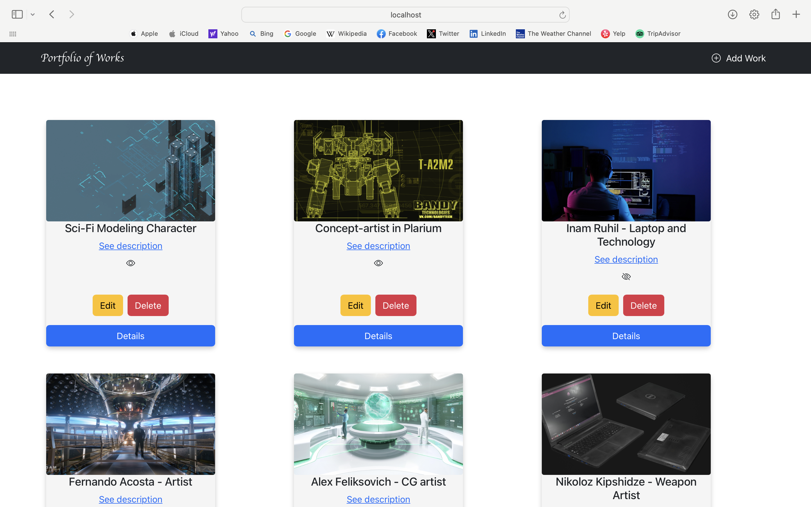

# DigitalArtPortfolio

DigitalArtPortfolio is a web application for digital artists to manage and showcase their artworks online. It provides a comprehensive set of features including artwork management, image uploads, and link additions to external sites.

## Features

- **Artwork Management**: Create, Read, Update, and Delete (CRUD) operations for managing artworks.
- **Portfolio Display**: Show artworks in a visually appealing grid format.
- **Image Upload**: Upload images for each artwork.
- **External Links**: Add links to client websites for each artwork.
- **Status Toggle**: Toggle the visibility status of each artwork (hidden/displayed).

## Project Structure

- **portfolio-app**: Frontend application built with React.
- **portfolio-backend**: Backend API built with NestJS and TypeORM.

### Directories

- `portfolio-app`
  - `src`: Contains all the frontend code.
  - `public`: Static assets like images and the `index.html` file.

- `portfolio-backend`
  - `src`: Contains all the backend code.
  - `uploads`: Directory for uploaded images.
  - `test`: Contains test files for the backend.

## Installation and Setup

### Prerequisites

- Node.js
- PostgreSQL

### Frontend Setup

1. Navigate to the frontend directory:

    ```bash
    cd portfolio-app
    ```

2. Install the dependencies:

    ```bash
    npm install
    ```

3. Start the frontend application:

    ```bash
    npm start
    ```

### Backend Setup

1. Navigate to the backend directory:

    ```bash
    cd portfolio-backend
    ```

2. Install the dependencies:

    ```bash
    npm install
    ```

3. Start the backend application:

    ```bash
    npm run start
    ```

## Dependencies

- **Frontend**: React, Axios, Bootstrap, React Router
- **Backend**: NestJS, TypeORM, Postgres, Multer

## Configuration

- **Database Configuration**: Configure the database connection in `src/work/work.module.ts`.
- **Environment Variables**: Ensure the correct environment variables are set for your database connection.

## Contribution

Contributions are welcome! Please follow these steps to contribute:

1. Fork the repository.
2. Create a new branch for your feature or bug fix.
3. Commit your changes.
4. Push to your branch.
5. Open a pull request.


## Contact

For questions or contributions, please contact [Ionel Boicu](mailto:boicu_ionel@yahoo.com).


# DigitalArtPortfolio
